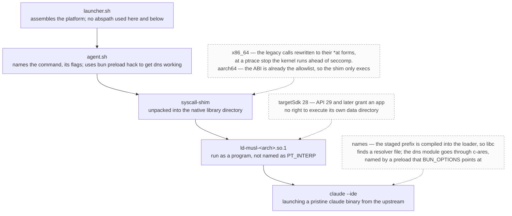

# harness.apk

> A full agentic loop delivered to your phone as a drop-in single apk

> 4 different tasks, handled by on-device agents: 1. places research; 2. harness modification and self update; 3. real browser usage; 4. ohmypi!

## Description

- Deploys on its own (data warning!)
  > The apk bootstraps it's own termux environment for the agent to use, downloads musl claude, and installs several shims for the musl claude to work. No Anthropic's intellectual property in this repo
- No patches, only shims and wrappers
  > Linux static musl build is a great target to run on android
- Ships with handles: view diffs, open files and urls
  > Built-in mcp server that utilizes Claude's IDE API and beyond
- Phone-friendly
  > Markdown writeups can contain map widgets for the model to build routes
- Rich interfacing
  > Several built-in capabilities like notification sending and intent triggering, aand with self adb, possibilities are endless: run as different programs, build and deploy programs written on android from said android to said android
- Different agents theoretically possible!
  > OhMyPi worked (but the left panel broke, which is expected). You can (and should!) try to put your favorite Codex or Pi in agent.sh and see for yourself. Merge requests are welcome.

## How it boots

## Restrictions

- It is modern android. We can't achieve a true persistence, so claude should be instructed to be careful with background jobs and heavy tasks. Session that spawns 333 shells with `echo true` **will** be killed by the system immediately
- targetSdk=28 and compileSdk=35

## Shoulders of giants we're standing on

- [ghostty](https://github.com/ghostty-org/ghostty) -- the best tty
- [ghostty-android](https://github.com/tapthaker/ghostty-android) author [@tapthaker](https://github.com/tapthaker), who did a lot of heavy lifting running it on an alien platform with an alien renderer
- [claude-code-android](https://github.com/ferrumclaudepilgrim/claude-code-android) for the inspiration with shimming glibc with bionic and in general showing me that it is possible
- [termux](https://github.com/termux/termux-packages) for the userland, and its wonderful community who provides precompiled stuff like arm ndk

## Roadmap

- More phone handles for the model
  - [ ] battery level
  - [ ] network status
  - [ ] bluetooth discovery
- More persistent android persistance
  - [ ] spawn agents as foreground services
  - [ ] spawn subagents as background tasks
  - [ ] explore tricks Termux uses to keep itself alive
- More UX stuff
  - [ ] Copy text from the writeup
  - [ ] Termux-like folder in android's native file chooser
  - [ ] More agents
  - [ ] Text editing?
- [ ] Figure out how can we run on more recent API versions without sacrificing much of the capability
- More proven skills / tools for interaction
  - [x] self-adb
  - [x] playwright

## Changelog

### v0.1.1

- More built-in skills
- New icon colors!
- The first public release
- Some bugs fixed

### v0.1.0

- Barebones claude-code harness works🎉
- Agents can show you diffs and files
- Supports Projects View (left side, projects/chat list) and Files View (right side, files in selected project)
  - Supports opening new dirs as projects
  - Supports adding files to projects
  - Files View are in sync with the current project in almost a hundret percent of the time
- Code highlighting
- Code selection in writeups and code files
- Ability to discard selection in writeups and code files (trust me, it deserves its own line in changelog)
- Screen rotation or low batterry spawns stray background agents no more
- Support rich map widgets in markdown writeups
- Agents can ping you by sending a notification
- Agents can send arbitrary intents
- Clickable links
- Lots of changes to get the stuff above working