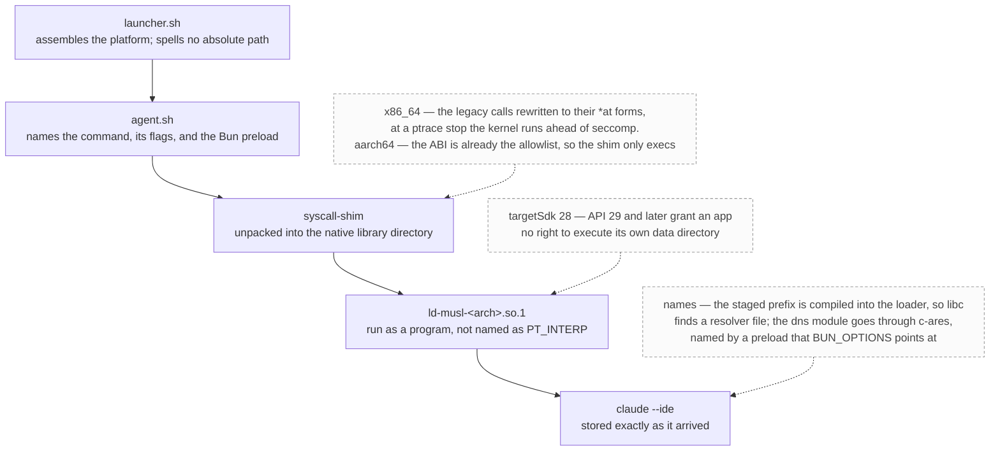

# harness.apk -- From Tinkerers For Tinkerers

>A full agentic loop delivered to your phone

## Description

- Puts an agent into an apk file, that allows agent to interact with the phone: show you diffs when proposing edits, open files, show you things on the map. The apk bootstraps it's own termux environment for the agent to use, and installs several shims for the musl claude to work. Untested with other CLI harnesses, although you can (and should!) try to put your favorite Codex or Pi in agent.sh and see for yourself.
- With self adb, possibilities are endless: run as different programs, deploy programs written on android from said android to said android. With Firefox USB Debugging enabled, agent can even drive your mobile Firefox instance

## How it boots

## Restrictions

- It is modern android. We can't achieve true persistence so claude should be instructed to be careful with background jobs and heaby tasks. Session that spawns 333 shells with `echo true` **will** be killed by the system immediately
- targetSdk=28 and compileSdk=35
- since there are no rich interactive widgets (yet), it is more like a proof of concept. But it works good enough to deliver *self updates* for this app

## Shoulders of giants we're standing on

- ghostty -- the best tty
- ghostty-android author @tapthaker, who did a lot of heavy lifting running it on an alien platform with an alien renderer
- claude-code-android for the inspiration with shimming glibc with bionic and in general showing me that it is possible
- termux for the userland, and it's wonderful community who provides precompiled stuff like arm ndk
