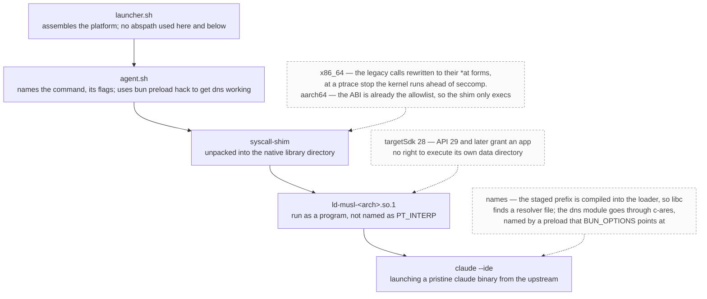

# harness.apk -- From Tinkerers For Tinkerers

>A full agentic loop delivered to your phone as a drop-in single apk

## Description

- Puts an agent into an apk file, that allows agent to interact with the phone: show you diffs when proposing edits, open files, show you things on the map. The apk bootstraps it's own termux environment for the agent to use, and installs several shims for the musl claude to work. Untested with other CLI harnesses, although you can (and should!) try to put your favorite Codex or Pi in agent.sh and see for yourself.
- With self adb, possibilities are endless: run as different programs, deploy programs written on android from said android to said android. With Firefox USB Debugging enabled, agent can even drive your mobile Firefox instance

## How it boots

## Restrictions

- It is modern android. We can't achieve a true persistence, so claude should be instructed to be careful with background jobs and heavy tasks. Session that spawns 333 shells with `echo true` **will** be killed by the system immediately
- targetSdk=28 and compileSdk=35
- not enough interactive widgets (only map), so it is more like a proof of concept. But it works good enough to deliver *self updates* for this app. And it succesfully planned my upcoming vacation

## Shoulders of giants we're standing on

- [ghostty](https://github.com/ghostty-org/ghostty) -- the best tty
- [ghostty-android](https://github.com/tapthaker/ghostty-android) author [@tapthaker](https://github.com/tapthaker), who did a lot of heavy lifting running it on an alien platform with an alien renderer
- [claude-code-android](https://github.com/ferrumclaudepilgrim/claude-code-android) for the inspiration with shimming glibc with bionic and in general showing me that it is possible
- [termux](https://github.com/termux/termux-packages) for the userland, and its wonderful community who provides precompiled stuff like arm ndk

## Changelog

### v0.1.0

- Barebones claude-code harness works🎉
- Agents can show you diffs and files
- Supports Projects View (left side, projects/chat list) and Files View (right side, files in selected project)
  - Supports opening new dirs as projects
  - Supports adding files to projects
  - Files View are in sync with the current project in almost a hundret percent of the time
- Code highlighting
- Code selection in writeups and code files
- Ability to discard selection in writeups and code files (trust me, it deserves its own line in changelog)
- Screen rotation or low batterry spawns stray background agents no more
- Support rich map widgets in markdown writeups
- Agents can ping you by sending a notification
- Agents can send arbitrary intents
- Clickable links
- Lots of changes to get the stuff above working